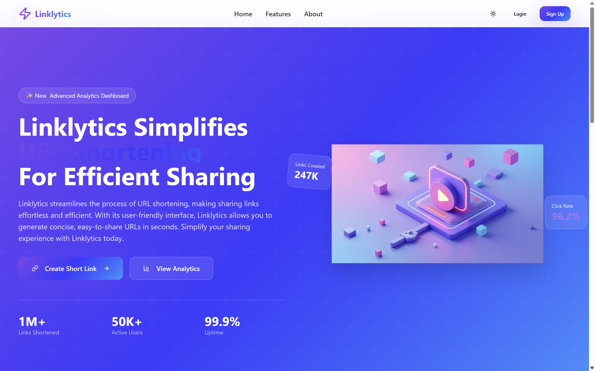

# Bitly Clone

A full-stack URL shortener application inspired by [Bitly](https://bitly.com/), built with **Spring Boot** (Java) for the backend and **React + TypeScript** for the frontend. This project is based on the [EmbarkX | Learn Programming](https://www.youtube.com/@EmbarkXLearnProgramming) YouTube course: [Build Bitly Clone | Spring Boot Full Stack Project | Deploy For FREE | Mastery Course in 12 HOURS](https://www.youtube.com/watch?v=YOUR_VIDEO_LINK).

## 🌐 Live Demo

- [bitly-clone-one.vercel.app](https://bitly-clone-one.vercel.app/)

## 📦 Source Code

- [GitHub Repository](https://github.com/Hmtgit7/bitly-clone)

---

## 🚀 Features

- User authentication (Sign up, Login, JWT-based auth)
- Shorten long URLs to custom short links
- Dashboard to manage and view all your shortened URLs
- Analytics for each URL (clicks, stats)
- Public and private routes
- Responsive UI with Tailwind CSS
- Error pages and custom loaders
- Dockerized for easy deployment
- Cloud database support

## 🛠️ Tech Stack

### Backend
- Java 17+
- Spring Boot
- Spring Security (JWT)
- Spring Data JPA (MySQL)
- Maven
- Docker

### Frontend
- React
- TypeScript
- Vite
- Tailwind CSS

---

## 📚 Learning Roadmap (from the course)

- Project setup in IntelliJ
- MySQL database modeling
- Authentication & JWT
- URL shortening logic
- Analytics & dashboard
- Frontend with React + Tailwind
- Dockerization & deployment
- Domain linking & end-to-end testing

For a detailed step-by-step guide, follow the [YouTube course](https://www.youtube.com/watch?v=YOUR_VIDEO_LINK) and [course roadmap](https://embarkx.com/roadmap).

---

## 🖥️ Local Development

### Prerequisites
- Node.js (v18+)
- Java 17+
- Maven
- MySQL

### Backend Setup
```bash
cd backend/url-shortner
# Configure MySQL in src/main/resources/application.properties
./mvnw spring-boot:run
```

### Frontend Setup
```bash
cd frontend
npm install
npm run dev
```

---

## 🐳 Docker

To run the app with Docker (backend):
```bash
cd backend/url-shortner
docker build -t bitly-backend .
docker run -p 8080:8080 bitly-backend
```

---

## 📦 Deployment

- Frontend: [Vercel](https://vercel.com/)
- Backend: Any cloud VM, Docker, or managed Java hosting
- Database: Cloud MySQL (e.g., PlanetScale, AWS RDS)

---

## 🙏 Credits & Resources

- [EmbarkX | Learn Programming YouTube](https://www.youtube.com/@EmbarkXLearnProgramming)
- [Course Roadmap](https://embarkx.com/roadmap)
- [Source Code](https://github.com/Hmtgit7/bitly-clone)

---

## 📄 License

This project is for educational purposes. Please refer to the course and author for licensing details. 